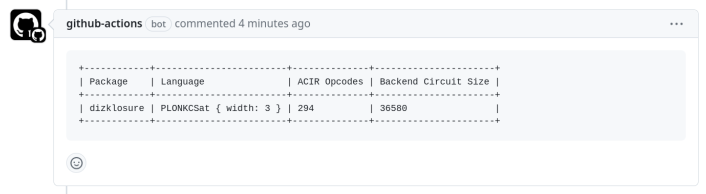

## `noir-circuit-info-action`

Primitive action to show [noir](https://github.com/noir-lang/noir) circuit info on your PRs. Currently includes ACIR opcodes and gate count.

Runs `nargo info` on some given directory (default: `circuits/`) and creates a comment with the output. An existing comment will be updated rather than duplicated.



### Setup

First, you'll need to make sure you have the appropriate read & write permissions set for your repo's actions. This allows for comment creation.

Go to `Settings > Actions > General` and enable the "Read and write permissions" toggle.

### Example Workflow

```
name: Circuit Gates
on:
  pull_request:
    branches: [main]

jobs:
  comment:
    runs-on: ubuntu-latest
    steps:
      - uses: actions/checkout@v2
      - uses: sambarnes/noir-circuit-info-action@main
```

